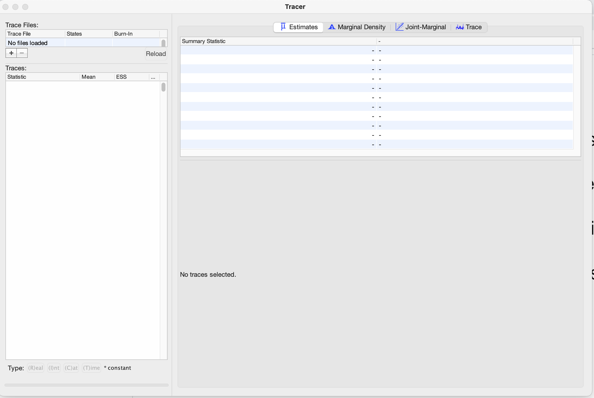
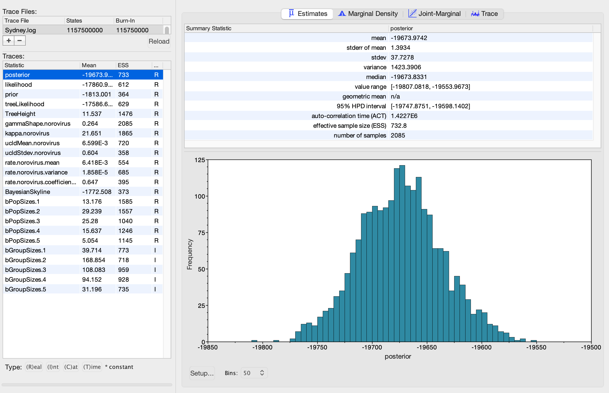
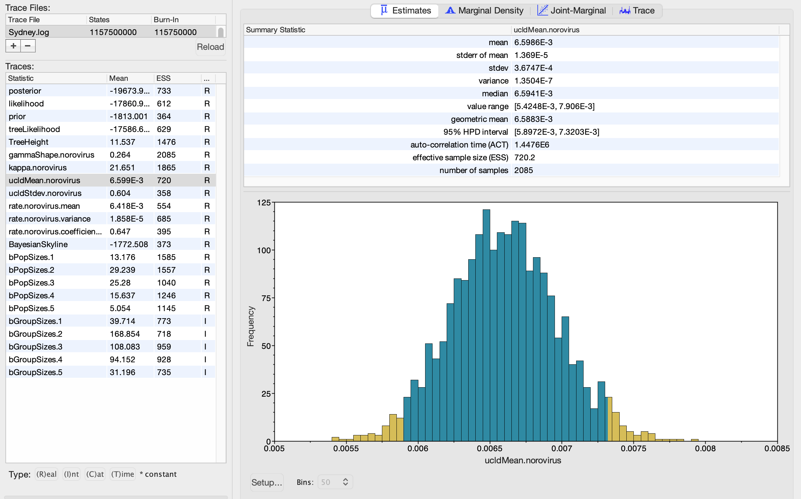
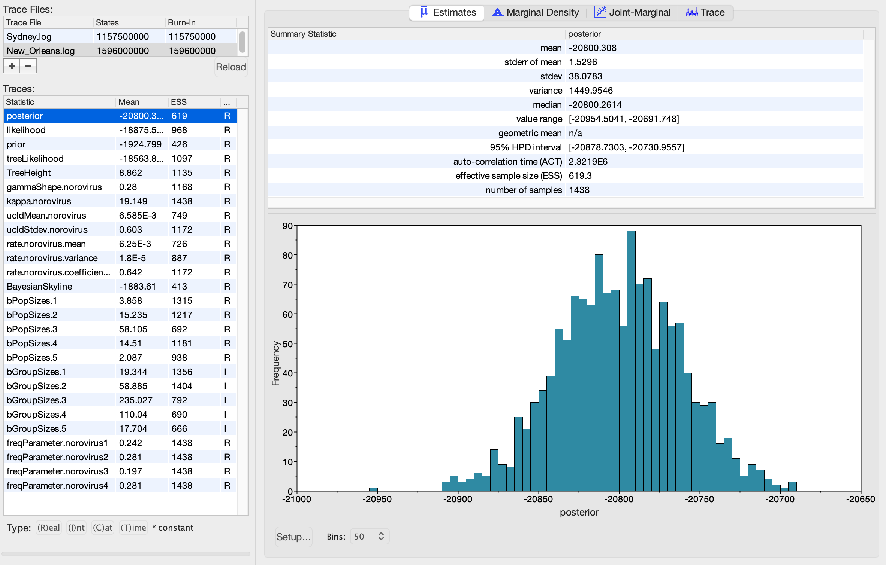
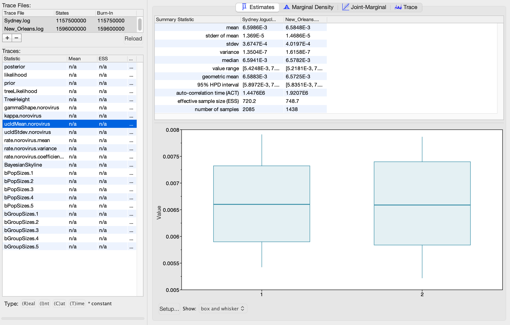

# Examining substitution rates and ancestor dates with BEAST

This tutorial requires prior installation of Tracer (downloaded from https://github.com/beast-dev/tracer/releases) and FigTree (downloaded from https://github.com/rambaut/figtree/releases)

In this tutorial, we will analyse the output from BEAST analyses of two pandemic variants of norovirus, a highly prevalent cause of gastroenteritis. We aim to:
1) Identify the substitution rate of each variant
2) Compare the substitution rates between variants
3) Examine ancestor dates to make inferences about the drivers of pandemic spread

### Loading files into Tracer

We will first use Tracer to examine the output from previous BEAST runs. BEAST outputs log files that contain the estimates of various parameters from the MCMC chain. Tracer summarises these log files to enable examination of posterior parameter estimates

When you open Tracer, you should see a window similar to this:



To load a log file, click the plus sign in the top left corner (below "No file selected"). Open "Sydney.log" which contains the output from BEAST runs on sequences from the Sydney 2012 norovirus variant. This variant caused a pandemic in 2012. Tracer should now look like this:



The parameters of the model that we can examine within Tracer are shown on the left. The "posterior" is selected by default - this is the posterior probability of the model. The right hand window shows a summary of the selected parameter, including the mean and median estimates, confidence intervals and a plot of the posterior distribution of the parameter

### Checking convergence

The first thing we need to check when we load a log file is whether the MCMC chain has converged. If it hasn't, we can't currently analyse the output as the estimates may not be reliable. We assess convergence by examining the effective sample size (ESS) scores, which are the number of effectively independent draws from the posterior distribution that the Markov chain is equivalent to

We want the ESS scores to be as large as possible. 200 is usually used as the minimum cutoff. If one or more ESS scores are below 200, we need to run the MCMC chain for longer (or start another independent run). The ESS scores are shown for each parameter on the left hand side

```
Question 1: Are the ESS scores all over 200? Do they suggest that the run has converged sufficiently to analyse?
```

### Examining the substitution rate

BEAST was run using a relaxed lognormal clock model. This employs a lognormal prior distribution with a mean value and a standard deviation. The substitution rate for each phylogenetic branch is sampled from this distribution.

There are 2 key parameters in the log file related to the substitution rate:
* ucldMean - the mean substitution rate
* ucldStdev - the standard deviation of the substitution rate distribution across phylogenetic branches. If this is 0, there is no rate variation between branches (i.e. a strict clock). If the confidence interval doesn't overlap 0, it provides support for at least some rate variation and therefore a relaxed clock

Click on ucldMean.norovirus on the left hand side. You should see the parameter estimates and distribution on the right hand side:



```
Question 2: What is the mean substitution rate?
Question 3: What is the confidence interval around this rate? Does this enable us to be certain about the rate?
```

Now click on ucldStdev.norovirus

```
Question 4: Does the confidence interval of the ucldStdev overlap 0? Does this support application of a relaxed clock model?
```

### Comparing the substitution rate between datasets

We've now seen how to examine substitution rates in BEAST output. We can also compare substitution rates between different datasets using Tracer. We'll compare the substitution rate of the Sydney 2012 variant we've already examined with another norovirus variant, New Orleans 2009 which caused a pandemic in 2009

Within the same Tracer window, click again on the plus sign in the top left corner and open "New_Orleans.log". This should open the second log file and keep the first file open, resulting in a view like this:



By clicking on files in the small window in the top left corner, we can choose which file to display. When we opened New_Orleans.log, this file is automatically selected to display. Let's first examine the ESS scores of the New Orleans 2009 run

```
Question 5: Do the ESS scores suggest that the run has converged sufficiently to analyse?
```

To compare multiple log files, we need to select them in the top left window. Click on Sydney.log, then hold shift and click on New_Orleans.log. This selects both files. You should see the bottom left window change - the Mean and ESS estimates change to n/a as we have multiple runs selected. The window should look like this:



The right hand windows now show the ucldMean estimates and distributions (now as boxplots) for each dataset

```
Question 6: How similar are the substitution rates in terms of their mean and confidence intervals?
Question 7: What does this suggest about the factors influencing the substitution rate between variants?
```

### Examining ancestor dates

We'll use previous BEAST runs (full details about the models and priors are in the 'Model setup' at the bottom of the tutorial) and first analyse log files which record the estimates of each parameter during the MCMC chain
