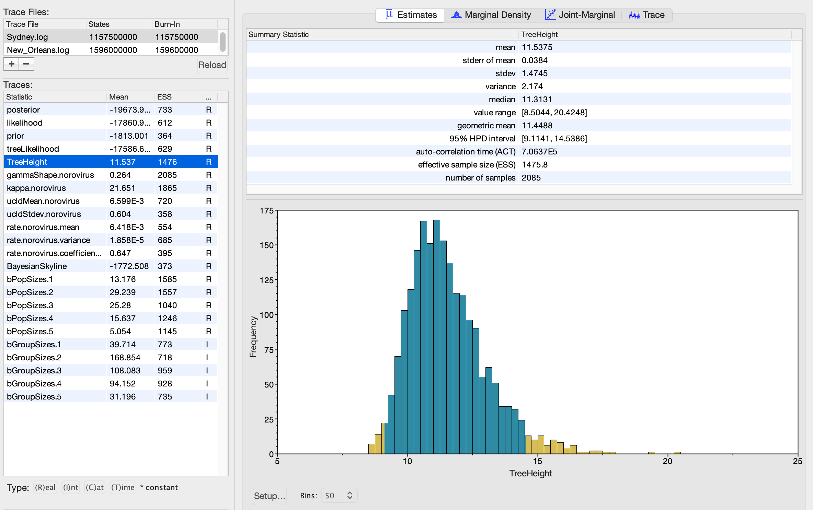
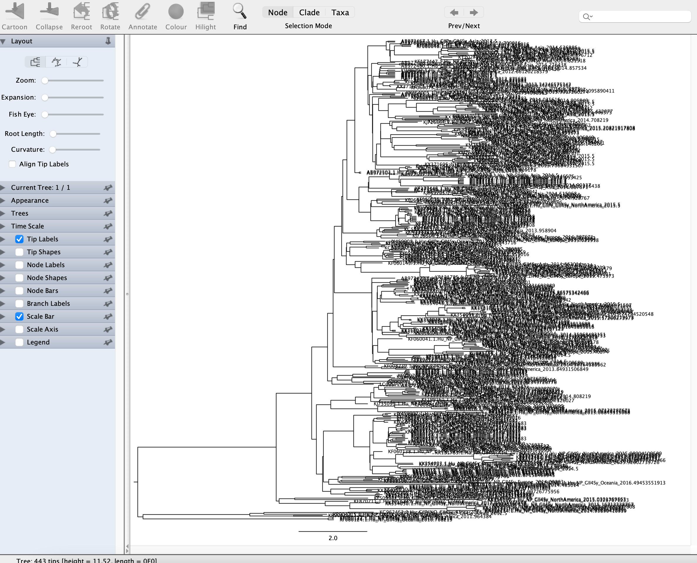
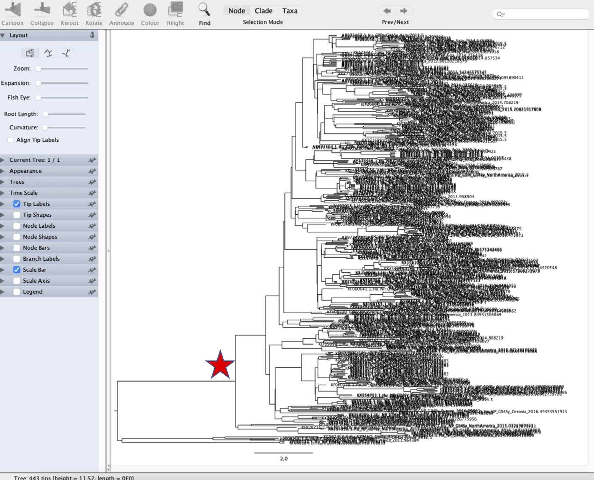
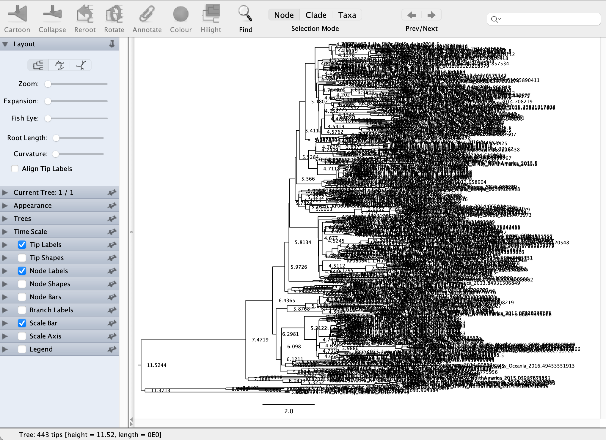

# Examining substitution rates and ancestor dates with BEAST

This tutorial requires prior installation of Tracer (downloaded from https://github.com/beast-dev/tracer/releases) and FigTree (downloaded from https://github.com/rambaut/figtree/releases)

In this tutorial, we will analyse the output from BEAST analyses of two pandemic variants of norovirus, a highly prevalent cause of gastroenteritis. We aim to:
1) Identify the substitution rate of each variant
2) Compare the substitution rates between variants
3) Examine ancestor dates to make inferences about the drivers of pandemic spread

### Loading files into Tracer

We will first use Tracer to examine the output from previous BEAST runs. BEAST outputs log files that contain the estimates of various parameters from the MCMC chain. Tracer summarises these log files to enable examination of posterior parameter estimates

When you open Tracer, you should see a window similar to this:


To load a log file, click the plus sign in the top left corner (below "No file selected"). Open "Sydney.log" which contains the output from BEAST runs on sequences from the Sydney 2012 norovirus variant. This variant caused a pandemic in 2012. Tracer should now look like this:


The parameters of the model that we can examine within Tracer are shown on the left. The "posterior" is selected by default - this is the posterior probability of the model. The right hand window shows a summary of the selected parameter, including the mean and median estimates, confidence intervals and a plot of the posterior distribution of the parameter

### Checking convergence

The first thing we need to check when we load a log file is whether the MCMC chain has converged. If it hasn't, we can't currently analyse the output as the estimates may not be reliable. We assess convergence by examining the effective sample size (ESS) scores, which are the number of effectively independent draws from the posterior distribution that the Markov chain is equivalent to

We want the ESS scores to be as large as possible. 200 is usually used as the minimum cutoff. If one or more ESS scores are below 200, we need to run the MCMC chain for longer (or start another independent run and combine). The ESS scores are shown for each parameter on the left hand side

```
Question 1: Are the ESS scores all over 200? Do they suggest that the run has converged sufficiently to analyse?
```

### Examining the substitution rate

BEAST was run using a relaxed lognormal clock model. This employs a lognormal prior distribution with a mean value and a standard deviation. The substitution rate for each phylogenetic branch is sampled from this distribution.

There are 2 key parameters in the log file related to the substitution rate:
* ucldMean - the mean substitution rate
* ucldStdev - the standard deviation of the substitution rate distribution across phylogenetic branches. If this is 0, there is no rate variation between branches (i.e. a strict clock). If the confidence interval doesn't overlap 0, it provides support for at least some rate variation and therefore a relaxed clock

Click on ucldMean.norovirus on the left hand side. You should see the parameter estimates and distribution on the right hand side:


```
Question 2: What is the mean substitution rate?
Question 3: What is the confidence interval around this rate? Does this enable us to be certain about the rate?
```

Now click on ucldStdev.norovirus

```
Question 4: Does the confidence interval of the ucldStdev overlap 0? Does this support application of a relaxed clock model?
```

### Comparing the substitution rate between datasets

We've now seen how to examine substitution rates in BEAST output. We can also compare substitution rates between different datasets using Tracer. We'll compare the substitution rate of the Sydney 2012 variant we've already examined with another norovirus variant, New Orleans 2009 which caused a pandemic in 2009

Within the same Tracer window, click again on the plus sign in the top left corner and open "New_Orleans.log". This should open the second log file and keep the first file open, resulting in a view like this:


By clicking on files in the small window in the top left corner, we can choose which file to display. When we opened New_Orleans.log, this file is automatically selected to display. Let's first examine the ESS scores of the New Orleans 2009 run

```
Question 5: Do the ESS scores suggest that the run has converged sufficiently to analyse?
```

To compare multiple log files, we need to select them in the top left window. Click on Sydney.log, then hold shift and click on New_Orleans.log. This selects both files. You should see the bottom left window change - the Mean and ESS estimates change to n/a as we have multiple runs selected. Then click ucldMean.norovirus to display summaries of this parameter for both datasets. The window should look like this:


The right hand windows now show the ucldMean estimates and distributions (now as boxplots) for each dataset

```
Question 6: How similar are the substitution rates in terms of their mean and confidence intervals?
Question 7: What does this suggest about the factors influencing the substitution rate between variants?
```

### Examining ancestor dates

For the final part of the tutorial, we'll examine the ancestor date of the Sydney 2012 variant and what this can tell us about pandemic origins

Click on the Sydney.log file in the top left window to go back to the parameter estimates for the Sydney 2012 variant. The TreeHeight parameter describes the date of the most recent common ancestor of the dataset (i.e. the root of the phylogenetic tree)

The TreeHeight is shown as the number of years since the latest tip in the tree, for example if the date of our latest virus sequence is 2016 and the TreeHeight is 5, the most recent common ancestor date would be 2016-5 = 2011

Click on the TreeHeight parameter:



The date of the most recent virus in this dataset is 2016.5

```
Question 8: What is the mean date of the most recent common ancestor of the tree?
Question 9: What is the confidence interval around this date?
```

The Sydney 2012 variant caused a pandemic that started in 2012. What factor was the proximate driver of this pandemic? As the virus was already circulating in humans, there are two previous hypotheses:
1) The pandemic was driven by a genetic change in the virus that enabled it to spread rapidly (e.g. an immune evasion mutation)
2) The pandemic was driven by a change in the human population that enabled rapid transmission of a virus that was already present

The most recent common ancestor date can help us to distinguish between these two possibilities. If the pandemic was driven by a genetic change in the virus, we'd expect the most recent common ancestor of the pandemic variant to occur shortly before the pandemic occurred, as the virus would acquire the mutation and then spread rapidly

However, if the pandemic was driven by a change in the human population, the most recent common ancestor of the pandemic variant might occur many years before the pandemic

```
Question 10: Given the most recent common ancestor date you inferred for Sydney 2012 above, can you infer whether the pandemic was most likely driven by a virus mutation or a change in the human population?
```

### Examining ancestor dates with FigTree

Tracer can only show us the estimated date for the most recent common ancestor of the dataset. We can examine the dates of other nodes in the tree by using FigTree

In addition to the log file, BEAST also outputs a file containing a posterior distribution of trees estimated during the MCMC chain. BEAST can extract the maximum clade credibility (MCC) tree from this distribution, which is the tree with the maximum product of the posterior clade probabilities. This is the tree most commonly used for examination and publication figures

The MCC tree is annotated with summaries from the posterior distribution of trees so we can see, for example, the most likely dates for any node in the tree, including confidence intervals

We'll load the MCC tree for Sydney 2012 into FigTree. To do this, open FigTree, then select File then select Open and select "Sydney.nex". You should see a view like this:



We're often interested to infer the dates of specific internal nodes within the phylogenetic tree. These nodes might correspond to, for example, introduction of the virus into a new geographical region or acquisition of a new mutation. By inferring the dates of specific nodes, we can infer the range of dates during which these events occurred

As an example, we'll examine the date of this node in the tree:



We can first examine whether the node is well supported, which it should be if we're going to examine it further. To check this, we need to turn node labels on. Click the check box next to "Node Labels" on the left hand side. You should see labels appear on each of the nodes in the tree:



We assess node support through the "posterior" node label which shows the proportion of phylogenetic trees in the posterior distribution in which the node is present. We can change the node labels to posterior supports by clicking the drop down to the left of "Node Labels" and changing the "Display" drop down to "posterior"

Depending on the application, different cutoffs for minimum posterior support are commonly applied, including 0.7, 0.9 and 0.95

```
Question 11: What is the posterior support on the node of interest? Is the node well supported?
```

We can now examine the date of the node. Updating the node label "Display" to height shows the number of years between the node and the most recent sequence in the dataset. Again, we calculate the date by subtracting the height from the most recent sequence date (2016.5 in this case). The "height\_95%\_HPD" display shows the confidence interval of the height of the node

```
Question 12: What is the most likely date of the node of interest?
Question 13: What are the confidence intervals of this date?
```
